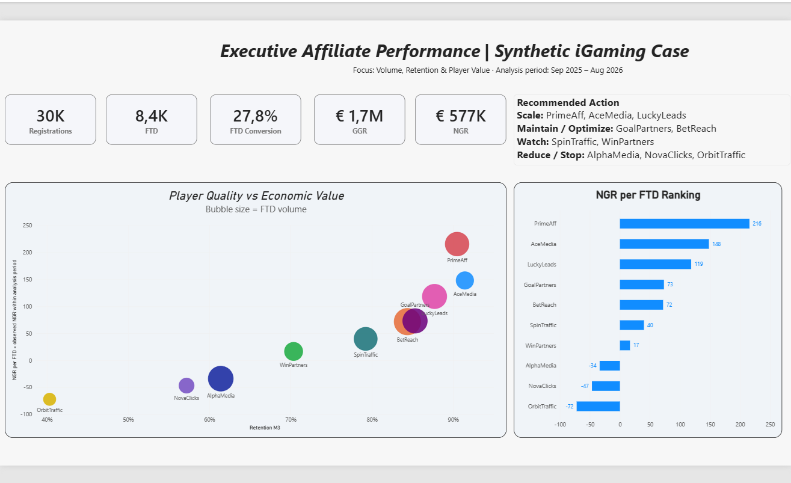
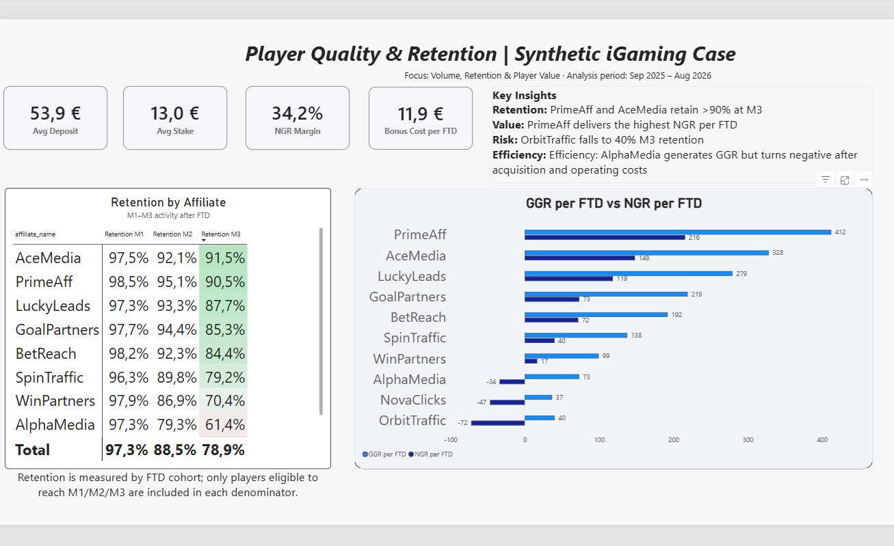

# iGaming Affiliate Performance — Power BI Case

A recruiter-facing Power BI case focused on a practical iGaming question:

> **Does the affiliate bringing the most FTDs also create the most value?**

The project compares affiliate acquisition volume with player quality, retention, GGR/NGR and unit economics using a **synthetic iGaming dataset**.

## Dashboard

### 1. Executive Affiliate Performance


### 2. Player Quality & Retention


## Business question

High FTD volume can look attractive at first glance, but volume alone does not show whether acquired players remain active or generate sustainable value.

This case evaluates affiliates using:
- Registrations and FTD
- FTD Conversion
- GGR and NGR
- NGR per FTD
- M1 / M2 / M3 retention
- Avg Deposit and Avg Stake
- NGR Margin
- Bonus and affiliate costs

## Key findings

- **PrimeAff** combines strong M3 retention with the highest NGR per FTD.
- **AceMedia** and **LuckyLeads** also show strong player quality and positive unit economics.
- **AlphaMedia** generates significant volume and GGR, but turns negative after acquisition and operating costs.
- **OrbitTraffic** combines weak M3 retention with negative unit economics.
- The analysis demonstrates that **high acquisition volume does not automatically mean high player value**.

## Recommended actions

- **Scale:** PrimeAff, AceMedia, LuckyLeads
- **Maintain / Optimize:** GoalPartners, BetReach
- **Watch:** SpinTraffic, WinPartners
- **Reduce / Stop:** AlphaMedia, NovaClicks, OrbitTraffic

## Retention methodology

Retention is measured by FTD cohort. Only players eligible to reach M1, M2 or M3 are included in the respective denominator.

## Tools

- Power BI
- DAX
- Power Query
- Data Modeling
- Excel / CSV

## Data

The dataset is **synthetic** and was created to simulate realistic iGaming affiliate acquisition, deposits, betting, bonuses and retention behavior.

The repository contains source data used for the case where practical. The full Power BI model is available in the release package.

## Download the Power BI report

[Download the PBIX from Release v1.0](https://github.com/Lantsov539/igaming-affiliate-performance-powerbi/releases/tag/v1.0)

## Project structure

```text
.
├── README.md
├── data/
├── screenshots/
│   ├── executive-affiliate-performance.png
│   └── player-quality-retention.png
└── powerbi/
```

## Portfolio focus

This project was designed as an employer-facing iGaming analytics case rather than a generic dashboard exercise, with emphasis on business decisions, player value and affiliate quality.
